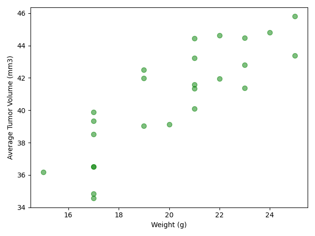
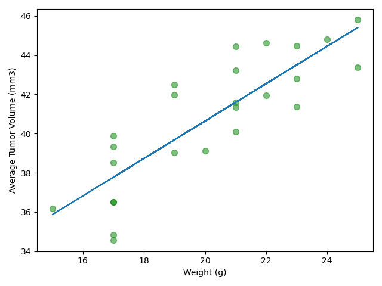
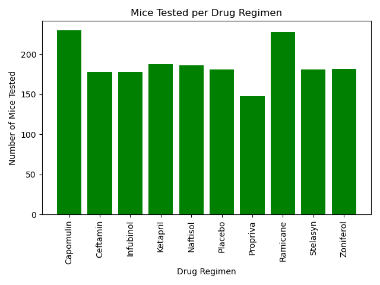
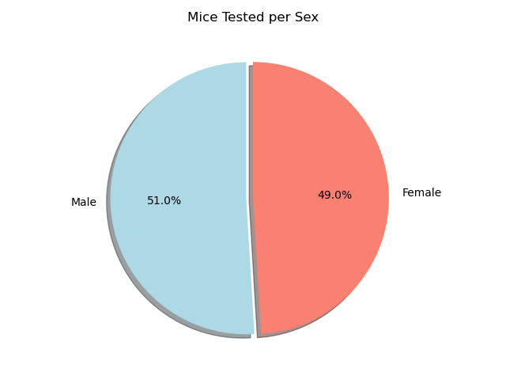
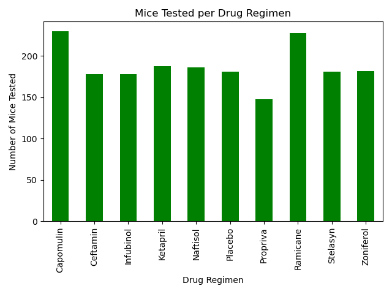
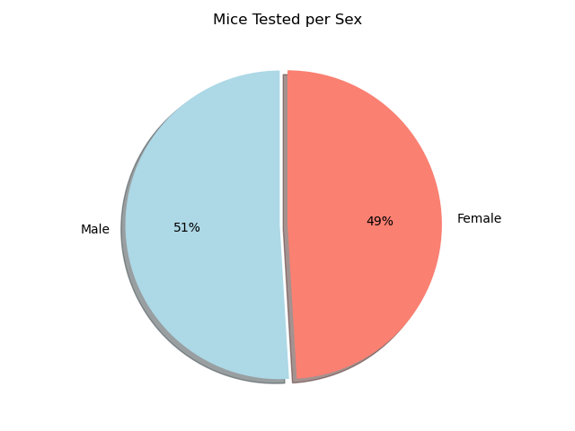
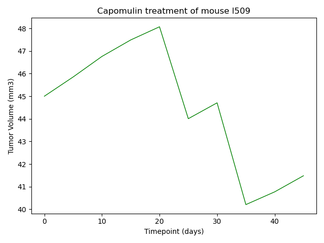
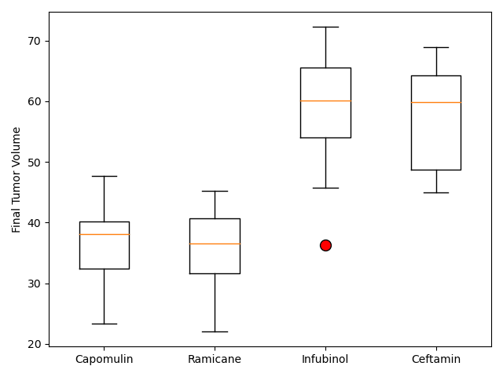

# Data Visualization Challenge

### Description
You've just joined Pymaceuticals, Inc., a new pharmaceutical company that specializes in anti-cancer medications. Recently, it began screening for potential treatments for squamous cell carcinoma (SCC), a commonly occurring form of skin cancer.

As a senior data analyst at the company, you've been given access to the complete data from their most recent animal study. In this study, 249 mice who were identified with SCC tumors received treatment with a range of drug regimens. Over the course of 45 days, tumor development was observed and measured. The purpose of this study was to compare the performance of Pymaceuticals’ drug of interest, Capomulin, against the other treatment regimens.

The executive team has tasked you with generating all of the tables and figures needed for the technical report of the clinical study. They have also asked you for a top-level summary of the study results.

### Info / Credits

- Analysis by
   * `João Pedro Fortunato` [@joaopedrofortunato](https://github.com/joaopedrofortunato)

- `REPO:` https://github.com/joaopedrofortunato/data-visualization_challenge.git

### Data Sources

(data/Mouse_metadata.csv)
(data/Study_results.csv)

### Outputs

